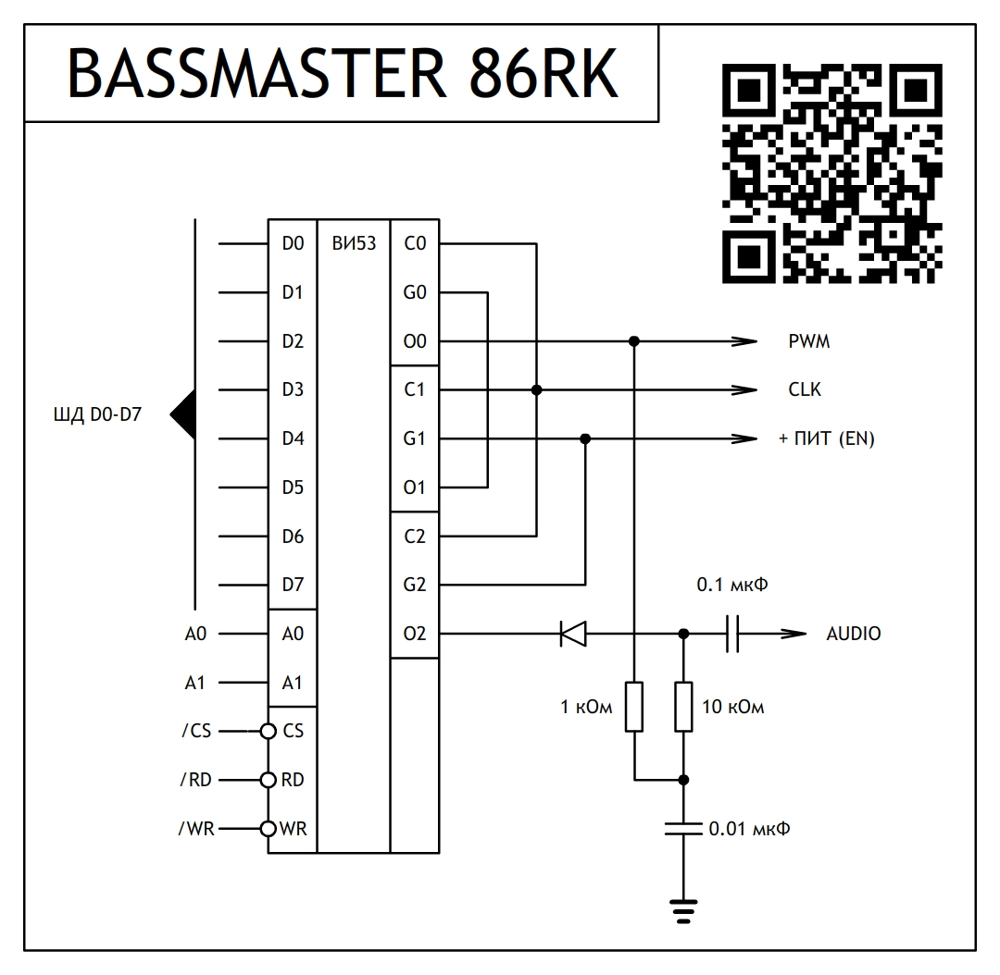
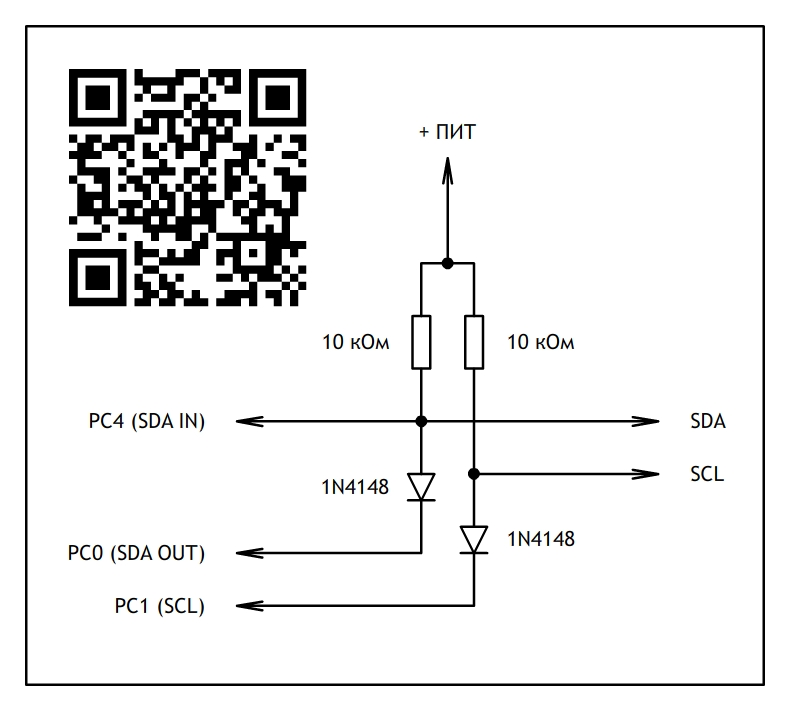

# MIR Disk Operating System / Дисковая операционная система `МИР`- (PeaceDOS)

[English manual](#english-manual) · [Русское руководство](#русское-руководство)

Fork of the original project by [Dmitry Ivanov](https://hub.mos.ru/dni-fx/peace-dos).

---

<a id="english-manual"></a>

# MIR Disk Operating System

The operating system (OS) was developed for computers based on the i8080 processor, including the Radio-86RK, Severnaya Palmira, Apogey, Mikrosha, Partner 01.01, and similar systems using the KR580VM80A, i8085, Z80, or other compatible processors. It fits into an 8 KB ROM and provides a minimal set of commands for working with the CH376 file interface.

The system includes an interpreter and a template engine, supports script execution, emulates the I2C protocol in software through the i8255 (KR580VV55) parallel port, displays WBMP graphics up to 127 × 127 pixels, and supports file and directory operations.

The CH376 file module is connected to the computer's system bus according to the module pinout. The `INT` and `RST` pins do not need to be connected.
Pinout and Gerber files are avaiable in this repository: https://github.com/explit28/Radio-86RK_CH376-Adapter

At startup, the OS checks whether the CH376 module and a storage medium are present. If the device is ready, `AUTOEXEC.SCP` is loaded from the storage medium and executed. If the device is absent or not ready, the script stored in ROM is executed instead. Disk operations are unavailable in that mode.

Two versions of the startup script are provided: `AUTOEXEC.SCP.EN` contains English messages, while `AUTOEXEC.SCP.RU` contains Russian messages. Copy the preferred version to the root directory of the USB stick and rename the copied file to `AUTOEXEC.SCP`.

The operating system is written entirely in assembly language using [Pretty Intel 8080 Assembler](https://svofski.github.io/pretty-8080-assembler/).

## Command List

### System information and memory

`CHKMEM` — test memory  
`SYSINFO` — display the system settings table

`JUMP XXXX` — jump unconditionally to address `XXXX`; option `L` enables compatibility mode  
`READ XXXX` — read one byte from memory address `XXXX` and display it  
`WRITE XXXX AA BB CC ...` — write a byte array to RAM beginning at address `XXXX`  
`DUMP AAAA BBBB` — display memory from address `AAAA` through `BBBB`

### Screen and text

`CLS` — clear the screen  
`FLUSH N` — scroll the text upward by `N` lines  
`CARRIAGE YYXX` — set the cursor position  
`TEXT XXXX` — print the string located at address `XXXX`  
`NL` — carriage return  
`XCG` — switch the character generator  
`POINTER XXXX` — set the string pointer to address `XXXX`

### Indicators, sound, and timing

`LEDON` — turn on the RUS/LAT LED  
`LEDOFF` — turn off the RUS/LAT LED

`BEEP NNMM` — generate a sound; `NN` is the duration and `MM` is the tone  
`PEW NNMM` — generate a sound; `NN` is the duration and `MM` is the tone  
`DELAY A` — delay for `A` video frames

### Port input and output

`IN XXXX YYYY ZZZZ` — read data from port addresses `YYYY` through `ZZZZ` into RAM beginning at address `XXXX`  
`OUT XXXX YYYY ZZZZ` — output data from RAM addresses `XXXX` through `YYYY`; the address beginning at `ZZZZ` is output through ports PB and PC

### Files, directories, and scripts

`/` — set the current path

`CAT` — list files in the root directory  
`MCAT ABCDE` — create a directory named `ABCDE`  
`ERASE ABCDE` — delete the file or directory named `ABCDE`  
`HELP` — open the help file; also available with the `F1` key  
`LOAD XXXX ABC*` — load file `ABC*` into RAM beginning at address `XXXX`  
`SAVE XXXX YYYY ABC*` — save `YYYY` bytes beginning at address `XXXX` as file `ABC*`  
`CALL ABC*` — load file `ABC*` into RAM and execute it; option `L` enables compatibility mode  
`VIEW ABC*` — load a text file named `ABC*` into RAM and display it  
`SCP ABC*` — load and interpret script `ABC*`

`WBMP ABC*` — load and display the image named `ABC*`  
`PLAY ABC*` — play the melody stored in file `ABC*`  
`PWM 0..3F` — control PWM on the VI53 timer at 27.7 kHz

### Script operations

`PVAR` — display the character stored in the script variable  
`KEYSCAN` — wait for a key press and display the key code  
`IF A B` — compare the variable with `A` and execute command `B` if they match

### I2C

`I2CSTART AA` — select the device with address `AA`  
`I2CSTOP` — return the transmission line to the idle state  
`I2CTX AA BB CC DD...` — transmit data  
`I2CRX` — receive data; option `!` receives without acknowledgement

### Monitor

`MONITOR` — exit to the Monitor control program

### Keyboard shortcuts

`F1` — help  
`СТР` — clear the screen  
`HOME` — video mode without line spacing  
`Up Arrow` — recall the previous command  
`Down Arrow` — display the current path

## Special Features

If a command in a script is preceded by `@`, command echo is disabled.

The `OUT` command sends data to a port and simultaneously displays a dump of that data. Port output `PC7` emulates the write signal for an external memory chip. The command was designed for programming chips such as the AT28C64.

Connect the chip to the port as follows:

```text
PA0 - PA7 → D0 - D7
PB0 - PB7 → A0 - A7
PC0 - PC4 → A8 - A12
PC7 → /CE
/OE → +5V
/WE → GND
```

Music playback uses a circuit based on the KR580VI53 timer. The circuit supports amplitude control and additionally provides one PWM channel.

A music file has a simple format. The first byte sets the note-amplitude decay rate from `$01` to `$3F`. Each following pair of bytes specifies the note duration in video frames and the note number. Five octaves are available. C in octave zero has index `0`. `$FE` represents a pause, and `$FF` is the mandatory end-of-melody marker.

Music files use the `.MUS` extension.

The I2C protocol is implemented by bit-banging the VV55 parallel port. To use I2C with the OS, an interface module must be added to the computer circuit. The pull-up resistors may be reduced to 4.7 kΩ.

## Programming in the OS Environment

### Calling OS commands from external programs

External programs can execute OS commands. Load the address of the string containing the command into the `HL` register pair, then call the OS entry point at `<OS location address> + 3`.

Example for the Radio-86RK:

```asm
ORIGIN equ $0000
OS     equ $E000

ORG ORIGIN

LXI H, CMD_TITLE
CALL OS + 3
RET

CMD_TITLE: db 'TEXT 1000', $00

ORG $1000
TXT_TITLE: db 'HELLO WORLD!!!', $0A, $0D, $00
```

This allows programs to load files and perform other OS operations.

### Template engine

The system includes a template engine for working with text. It reduces string length and makes structured-data output more convenient. Every text string must end with `$00`.

Template-engine control characters:

`$09` — tabulation, 8 characters  
`$0A` — line feed  
`$0D` — carriage return  
`$80` — display the following byte in hexadecimal format  
`$81` — display the following word in decimal format  
`$DF` — wait for a key press

The following control characters are used together with `POINTER`, which points to an array of structured data. This construction is called a template.

`$F0-$FF` — display a character from `POINTER + offset 0..F`  
`$E0-$EF` — display the hexadecimal value of a byte from `POINTER + offset 0..F`  
`$DB` — display the value at address `POINTER` in binary format  
`$D8` — display `POINTER` in hexadecimal format  
`$D0-$D7` — display the decimal value of a word from `POINTER + offset 0..8`

A template for displaying a file-directory entry therefore looks like this:

```asm
db $F0, $F1, $F2, $F3, $F4, $F5, $F6, $F7, " ", $F8, $F9, $FA, " ", $EB, " ", $ED, $EC, " ", $D7, $0A, $0D, $00
```

The first 12 bytes display the filename and extension. They are followed by the file attribute in hexadecimal format, the initial file cluster in hexadecimal format, the file length in decimal format, and the end of the line.

To display the next directory entry, move `POINTER` to the required record and invoke the template again. The same mechanism can be used to display records from a structured database. The OS also uses templates to display memory dumps and the lengths of loaded files.

### Script variable

Scripts have a single variable. The results of `READ`, `KEYSCAN`, and `I2CRX` are stored in this variable. `IF` compares its argument with this variable.

`PVAR` displays the variable as a character on the command line. This is useful, for example, after receiving data with `I2CRX` when text from an external device must be read and displayed.

### Background tasks

Simple background tasks are executed while the keyboard is being polled. If no key is pressed, the OS performs a `CALL` to the address stored in `VECTOR`. A `JMP` instruction can be placed at that address to transfer control to a custom handler.

---

<a id="русское-руководство"></a>

# Дисковая операционная система `МИР`

Операционная система (ОС) разработана для ЭВМ с процессором i8080 (Радио-86РК, Северная Пальмира, Апогей, Микроша, Партнёр 01.01) и аналогичных: КР580ВМ80А, i8085, Z80 и другие. Помещается в ПЗУ объёмом 8 кб. Обеспечивает минимальный набор команд для работы с файловым интерфейсом CH376.<br>

Система имеет интерпретатор, шаблонизатор, поддерживает выполнение сценариев, программно эмулирует протокол I2C через параллельный порт i8255 (КР580ВВ55), позволяет просматривать графику формата WBMP в размере до 127х127 пикселей, поддерживает работу с файлами и каталогами.<br>

Файловый модуль CH376 подключается в системную шину ЭВМ согласно распиновки модуля. Выводы INT и RST подключать не нужно.<br>
Pinout and герберы находятся в этом репозитории: https://github.com/explit28/Radio-86RK_CH376-Adapter


При запуске ОС определит наличие модуля CH376 и носителя информации в нём. Если устройство готово к работе, с носителя информации будет загружен и выполнен сценарий AUTOEXEC.SCP. Если устройство не готово к работе или отсутствует, будет выполнен сценарий из ПЗУ. В этом случае дисковые операции будут недоступны.

Предусмотрены две версии стартового сценария: `AUTOEXEC.SCP.EN` содержит сообщения на английском языке, а `AUTOEXEC.SCP.RU` — на русском. Скопируйте выбранную версию в корневой каталог USB-накопителя и переименуйте скопированный файл в `AUTOEXEC.SCP`.

Операционная система полность написана на ассемблере в среде Прекрасный Ассемблер (Pretty Intel 8080 Assembler): https://svofski.github.io/pretty-8080-assembler/

## Список команд:

`CHKMEM` - проверка памяти<br/>
`SYSINFO` - вывод таблицы системных настроек<br/>

`CLS` - очистка экрана<br/>
`FLUSH N` - скролл текста вверх на N строк<br/>
`CARRIAGE YYXX` - установка каретки<br/>
`TEXT ХХХХ` - печать строки с адреса ХХХХ<br/>
`NL` - перевод каретки<br/>
`XCG` - переключение знакогонератора<br/>
`POINTER XXXX` - установка указателя на строку по адресу XXXX<br/>

`LEDON` - включить светодиод РУС/ЛАТ<br/>
`LEDOFF` - выключить светодиод РУС/ЛАТ<br/>

`BEEP NNMM` - звуковой сигнал, где NN - длительность, MM - тон<br/>
`PEW NNMM` - звуковой сигнал, где NN - длительность, MM - тон<br/>
`DELAY A` - задержка на A кадров<br/>

`JUMP ХХХХ` - безусловный переход на адрес ХХХХ, ключ 'L' - режим совместимости<br/>
`READ ХХХХ` - чтение байта из ячейки памяти ХХХХ и вывод на экран<br/>
`WRITE XXXX AA BB CC ...` - запись массива данных в ОЗУ с адреса XXXX<br/>
`IN XXXX YYYY ZZZZ` - чтение данных из порта в ОЗУ с адреса XXXX, адреса на порту с YYYY по ZZZZ<br/>
`OUT XXXX YYYY ZZZZ` - вывод данных в порт из ОЗУ с адреса XXXX по YYYY на PB и PC выводится адрес начиная с ZZZZ<br/>
`DUMP AAAA BBBB` - просмотр памяти с адреса AAAA по адрес BBBB<br/>

`/` - установка текущего пути

`CAT` - каталог файлов корневой директории<br/>
`MCAT ABCDE` - создание каталога с именем ABCDE<br/>
`ERASE ABCDE` - удаление файла или каталога каталога с именем ABCDE<br/>
`HELP` - вызов файла справки (клавиша Ф1)<br/>
`LOAD XXXX ABC*` - загрузка файла ABC* в ОЗУ с адреса XXXX<br/>
`SAVE XXXX YYYY ABC*` - сохранение файла ABC* с адреса XXXX и длиной YYYY<br/>
`CALL ABC*` - загрузка файла ABC* в ОЗУ и вызов, ключ 'L' - режим совместимости<br/>
`VIEW ABC*` - загрузка текстового файла ABC* в ОЗУ и просмотр<br/>
`SCP ABC*` - загрузка и интерпретация сценария ABC*<br/>

`WBMP ABC*` - загрузка и отображение картинки с именем ABC*<br/>
`PLAY ABC*` - прроиграть мелодию из файла с именем ABC*<br/>
`PWM 0..3F` - управление ШИМ на ВИ53 27.7 кГц<br/>

`PVAR` - вывод символа из переменной на экран<br/>
`KEYSCAN` - Ожидание нажатия клавиши и вывод кода клавиши<br/>
`IF A B` - сравнение переменной с A и выполнение команды B при условии совпадения<br/>

`I2CSTART AA` - выбрать устройство с адресом AA<br/>
`I2CSTOP` - перевод линии передачи в режим ожидания<br/>
`I2CTX AA BB CC DD...` - передача данных<br/>
`I2CRX` - приём данных, ключ '!' - без подтверждения приёма<br/>

`MONITOR` - выход в управляющую программу Монитор<br/>

Клавиши: `Ф1` - помощь, `СТР` - очистка экрана, `HOME` - видеорежим без межстрочных интервалов, `стрелка вверх` - последняя команда, `стрелка вниз` - текущий путь

## Особенности

Если в сценарии перед командой стоит символ @, то эхо отключается.

Команда OUT выдаёт данные в порт и одновременно выводит дамп этих данных. Выход порта PC7 эмулирует сигнал записи во внешнюю микросхему памяти. Команда разработана для прошивки микросхем типа AT28C64. Подключение микросхемы к порту:

PA0 - PA7 → D0 - D7<br/>
PB0 - PB7 → A0 - A7<br/>
PC0 - PC4 → A8 - A12<br/>
PC7 → /CE<br/>
/OE → +5V<br/>
/WE → GND<br/>

Для воспроизведения музыки применяется схема на таймере КР580ВИ53. Такая схема реализует возможность управления амплитудой и дополнительно предоставляет один канал ШИМ:



Файл содержащий музыку имеет очень простой формат. Первый байт в файле задает скорость падения амплитуды ноты $01-$3F. Последующие пары байт указыват на продолжительность звучания ноты в кадрах, и номер ноты. Всего доступно 5 октав. Нота "До" нулевой октавы имеет индекс 0. Значение $FE - пауза. Значение $FF - обязательный признак конца мелодии.

Музыкальные файлы хранятся с расширением .MUS

Протокол I2C реализован ногодрыгом через параллельный порт ВВ55. Для того, чтобы ОС могла работать по протоколу I2C, необходимо в схему ЭВМ добавить модуль сопряжения:



Сопротивление подтягивающих резисторов можно уменьшить до 4.7 кОм.

## Программирование в среде ОС

**Внешние программы могут выполнять команды ОС.** Для этого в регистровую пару HL нужно поместить адрес строки, в которой написана команда. Далее нужно сделать вызов CALL <Адрес размещения ОС> + 3, например для ЭВМ Радио-86РК:<br/>

*ORIGIN          equ $0000*<br/>
*OS              equ $E000*<br/>

*ORG ORIGIN*<br/>

*LXI H, CMD_TITLE*<br/>
*CALL OS + 3*<br/>
*RET*<br/>

*CMD_TITLE:      db 'TEXT 1000', $00;*<br/>

*ORG $1000*<br/>
*TXT_TITLE:      db 'HELLO WORLD!!!', $0A, $0D, $00*<br/>

Таким образом программы могут загружать файлы и выполнять иные операции.

**Для работы с текстами в системе предусмотрен шаблонизатор**. Данный механизм позволяет экономить длину строк, и делает вывод структурированных данных удобным. Текстовая строка всегда должна заканчиваться символом $00. Управляющие символы шаблонизатора:

`$09` - табуляция, 8 символов<br/>
`$0A` - перевод строки<br/>
`$0D` - возврат каретки<br/>
`$80` - вывод следующего байта в формате HEX<br/>
`$81` - вывод следующего слова в формате DEC<br/>
`$DF` - ожидание нажатия клавиши<br/>

Следующие управляющие символы используются вместе с указателем на массив структурированных данных - POINTER. Такая конструкция называется шаблон.

`$F0-$FF` - вывод символа с позиции POINTER + смещение 0..F<br/>
`$E0-EF` - вывод HEX значения байта с позиции POINTER + смещение 0..F<br/>
`$DB` - вывод значения по адресу POINTER в BIN<br/>
`$D8` - вывод POINTER в формате HEX<br/>
`$D0-D7` - вывод DEC значения слова с позиции POINTER + смещение 0..8<br/>

Таким образом, шаблон для вывода каталога файлов будет выглядеть, как строка:

*db $F0, $F1, $F2, $F3, $F4, $F5, $F6, $F7, " ", $F8, $F9, $FA, " ", $EB, " ", $ED, $EC, " ", $D7, $0A, $0D, $00*

— где первые 12 байт выводят имя файла с расширением, далее атрибут файла (HEX), начальный кластер файла (HEX), длина файла (DEC) и конец строки.

Чтобы вывести на экран следующую строку каталога файлов, достаточно переместить POINTER на нужную запись и снова вызвать вывод шаблона. Так можно делать вывод записей структурированной базы данных. Аналогично в ОС реализованы шаблоны вывода дампа и вывода длины загружаемых файлов.

**Для работы в сценариях есть одна единственная переменная.** В эту переменную записываются результаты операций READ, KEYSCAN и I2CRX. Оператор IF делает сравнение с этой переменной. Оператор PVAR выводит литерное значение переменной в командную строку, например это удобно после приёма данных оператором I2CRX, если нужно считать и отобразить строку текста из устройства.

**Выполнение простых фоновых задач происходит во время опроса клавиатуры.** Если клавиши клавиатуры не нажимаются, происходит вызов CALL по адресу VECTOR. По этому адресу можно разместить дирестиву JMP и передать управление своему обработчику.
