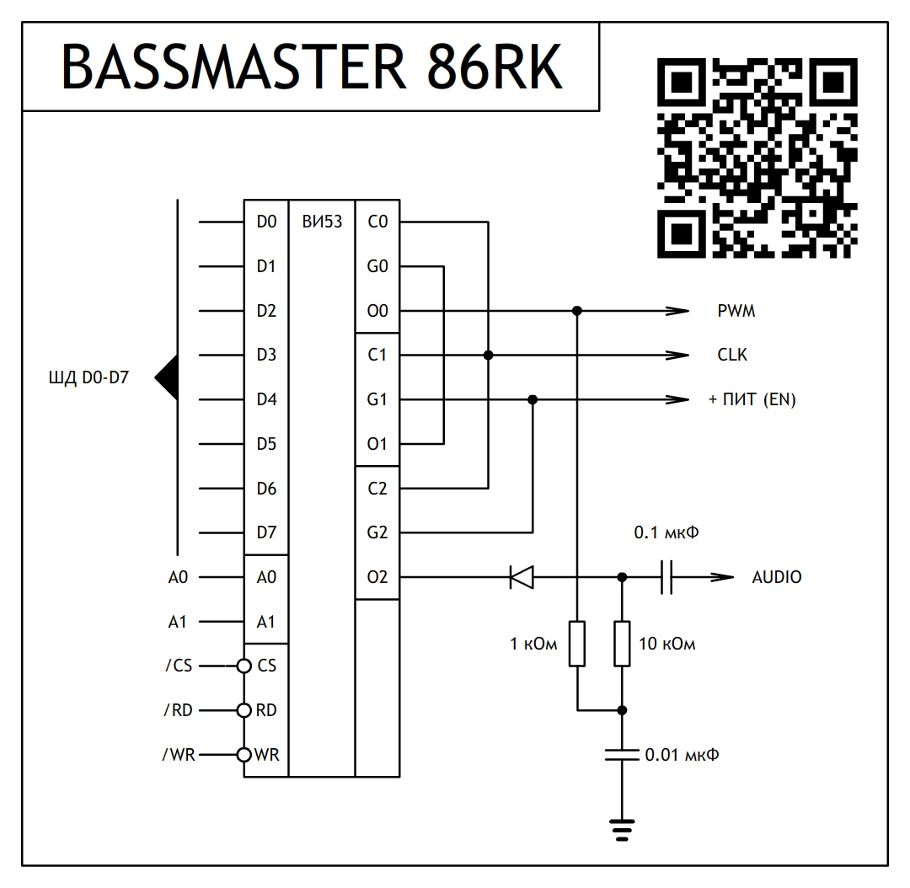
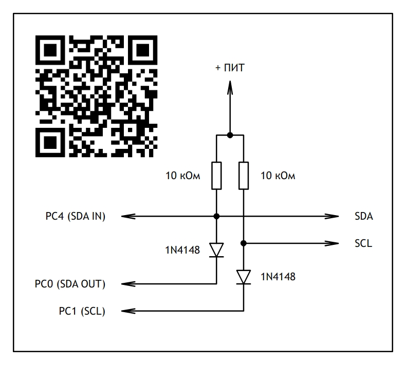

# PeaceDOS / MIR Disk Operating System «МИР»

[English](#english) · [Русский](#russian)

PeaceDOS is a fork of the original **МИР** project by [Dmitry Ivanov](https://hub.mos.ru/dni-fx/peace-dos).

---

<a id="english"></a>

# English

## Overview

PeaceDOS is a compact disk operating system for computers based on the Intel 8080 architecture. It was developed for the Radio-86RK, Severnaya Palmira, Apogey, Mikrosha, Partner 01.01, and similar systems using the KR580VM80A, Intel 8085, Z80, or another compatible processor.

The operating system fits into an **8 KB ROM** and provides a command interpreter and file access through a CH376 module.

Main features:

- file and directory operations through CH376;
- startup scripts and manually executed scripts;
- a text template engine;
- software I2C through the i8255 / KR580VV55 parallel interface;
- monochrome WBMP image display up to 127 × 127 pixels;
- music playback through the KR580VI53 timer;
- PWM output through the KR580VI53 timer;
- calls to OS commands from external programs;
- simple background-task support.

Prebuilt ROM images and startup files are provided for the Radio-86RK. A separate ROM image is included for Severnaya Palmira.

## CH376 connection

Connect the CH376 file module to the computer's system bus according to the module pinout. The `INT` and `RST` pins are not required by PeaceDOS.

A CH376 adapter PCB, pinout, and Gerber files are available in the separate [Radio-86RK CH376 Adapter repository](https://github.com/explit28/Radio-86RK_CH376-Adapter).

## Startup and language selection

At startup, PeaceDOS checks for the CH376 module and a storage medium.

- If both are ready, the OS loads and executes `AUTOEXEC.SCP` from the root directory of the storage medium.
- If the module or storage medium is unavailable, the startup script stored in ROM is executed instead. Disk operations are unavailable in this mode.

Two startup-script variants are included:

- `AUTOEXEC.SCP.EN` — English messages;
- `AUTOEXEC.SCP.RU` — Russian messages.

Copy the preferred file to the root directory of the USB storage device and rename the copy to `AUTOEXEC.SCP`.

The Radio-86RK directory also contains `peace.dos.en`, an English ROM variant.

## Repository contents

| Path | Contents |
| --- | --- |
| [`Радио-86РК/`](Радио-86РК/) | Radio-86RK ROM images, ZIP archive, startup scripts, and logo |
| [`Северная пальмира/`](Северная%20пальмира/) | Severnaya Palmira ROM image and ZIP archive |
| [`AT28C64/`](AT28C64/) | Script for programming an AT28C64 EEPROM |
| [`I2C/`](I2C/) | Example scripts for PCF8563 and SSD1306 devices |
| [`IMAGES/`](IMAGES/) | Example WBMP images |
| [`MUSIC/`](MUSIC/) | Music files, tracker binary, tracker archive, and usage notes |
| [`PWM53.jpg`](PWM53.jpg) | KR580VI53 music synthesizer and PWM circuit |
| [`86RK_I2C.jpg`](86RK_I2C.jpg) | I2C interface circuit for an i8080-class computer |

## Development

PeaceDOS is written in Intel 8080 assembly language and is intended for use with [Pretty Intel 8080 Assembler](https://svofski.github.io/pretty-8080-assembler/).

## Command reference

### System information and memory

`CHKMEM` — test memory<br>
`SYSINFO` — display the system-settings table<br>
`JUMP XXXX` — jump unconditionally to address `XXXX`; option `L` enables compatibility mode<br>
`READ XXXX` — read one byte from memory address `XXXX` and display it<br>
`WRITE XXXX AA BB CC ...` — write a byte array to RAM beginning at address `XXXX`<br>
`DUMP AAAA BBBB` — display memory from address `AAAA` through `BBBB`

### Screen and text

`CLS` — clear the screen<br>
`FLUSH N` — scroll the text upward by `N` lines<br>
`CARRIAGE YYXX` — set the cursor position<br>
`TEXT XXXX` — print the zero-terminated string located at address `XXXX`<br>
`NL` — carriage return<br>
`XCG` — switch the character generator<br>
`POINTER XXXX` — set the structured-data pointer to address `XXXX`

### Indicators, sound, and timing

`LEDON` — turn on the RUS/LAT LED<br>
`LEDOFF` — turn off the RUS/LAT LED<br>
`BEEP NNMM` — generate a sound; `NN` is the duration and `MM` is the tone<br>
`PEW NNMM` — generate a sound; `NN` is the duration and `MM` is the tone<br>
`DELAY A` — delay for `A` video frames

### Port input and output

`IN XXXX YYYY ZZZZ` — read data from port addresses `YYYY` through `ZZZZ` into RAM beginning at address `XXXX`<br>
`OUT XXXX YYYY ZZZZ` — output data from RAM addresses `XXXX` through `YYYY`; the address beginning at `ZZZZ` is placed on ports PB and PC

### Files, directories, and scripts

`/` — set the current path<br>
`CAT` — list files in the root directory<br>
`MCAT ABCDE` — create a directory named `ABCDE`<br>
`ERASE ABCDE` — delete the file or directory named `ABCDE`<br>
`HELP` — open the help file; also available with `F1`<br>
`LOAD XXXX ABC*` — load file `ABC*` into RAM beginning at address `XXXX`<br>
`SAVE XXXX YYYY ABC*` — save `YYYY` bytes beginning at address `XXXX` as file `ABC*`<br>
`CALL ABC*` — load file `ABC*` into RAM and execute it; option `L` enables compatibility mode<br>
`VIEW ABC*` — load and display text file `ABC*`<br>
`SCP ABC*` — load and interpret script `ABC*`<br>
`WBMP ABC*` — load and display image `ABC*`<br>
`PLAY ABC*` — play the melody stored in file `ABC*`<br>
`PWM 0..3F` — control the KR580VI53 PWM output at 27.7 kHz

### Script operations

`PVAR` — display the character stored in the script variable<br>
`KEYSCAN` — wait for a key press and display its code<br>
`IF A B` — compare the script variable with `A` and execute command `B` if they match

### I2C

`I2CSTART AA` — select the device with address `AA`<br>
`I2CSTOP` — return the bus to the idle state<br>
`I2CTX AA BB CC DD...` — transmit data<br>
`I2CRX` — receive data; option `!` receives without acknowledgement

### Monitor

`MONITOR` — exit to the Monitor control program

## Keyboard shortcuts

| Key | Action |
| --- | --- |
| `F1` | Open help |
| `СТР` | Clear the screen |
| `HOME` | Select video mode without line spacing |
| `↑` | Recall the previous command |
| `↓` | Display the current path |

## Special features

### Suppressing command echo

Prefix a script command with `@` to suppress command echo.

### Programming an AT28C64

The `OUT` command sends data to a port and simultaneously displays a dump of the transferred data. Port output `PC7` emulates the write signal for an external memory chip. This function was designed for programming EEPROMs such as the AT28C64.

Connect the EEPROM as follows:

```text
PA0 - PA7 → D0 - D7
PB0 - PB7 → A0 - A7
PC0 - PC4 → A8 - A12
PC7       → /CE
/OE       → +5V
/WE       → GND
```

An example script is included in [`AT28C64/at28c64.scp`](AT28C64/at28c64.scp).

### Music and PWM

Music playback uses a circuit based on the KR580VI53 timer. The circuit supports amplitude control and provides one additional PWM channel.



A `.MUS` file has the following format:

1. The first byte specifies the note-amplitude decay rate from `$01` through `$3F`.
2. Each following pair of bytes specifies the note duration in video frames and the note number.
3. Five octaves are available. C in octave zero has note index `0`.
4. `$FE` represents a pause.
5. `$FF` is the required end-of-melody marker.

The [`MUSIC/`](MUSIC/) directory contains example melodies and the `TRACKER.BIN` player. Example:

```text
CALL TRACKER.BIN DREAM.MUS
```

### I2C interface

I2C is implemented in software by bit-banging the VV55 parallel port. Add the following interface circuit to the computer to use I2C devices with PeaceDOS:



The pull-up resistors may be reduced to **4.7 kΩ**.

Example scripts for the PCF8563 real-time clock and SSD1306 display are included in the [`I2C/`](I2C/) directory.

## Programming in the PeaceDOS environment

### Calling OS commands from external programs

An external program can execute a PeaceDOS command by loading `HL` with the address of a zero-terminated command string and calling `<OS base address> + 3`.

Example for the Radio-86RK:

```asm
ORIGIN equ $0000
OS     equ $E000

ORG ORIGIN

LXI H, CMD_TITLE
CALL OS + 3
RET

CMD_TITLE: db 'TEXT 1000', $00

ORG $1000
TXT_TITLE: db 'HELLO WORLD!!!', $0A, $0D, $00
```

This mechanism allows an external program to load files and use other OS operations.

### Template engine

PeaceDOS includes a template engine for text output. It shortens strings and simplifies the display of structured data. Every text string must end with `$00`.

General control characters:

`$09` — tabulation, 8 characters<br>
`$0A` — line feed<br>
`$0D` — carriage return<br>
`$80` — display the following byte in hexadecimal format<br>
`$81` — display the following word in decimal format<br>
`$DF` — wait for a key press

The following control characters operate on the structured-data array addressed by `POINTER`:

`$F0-$FF` — display a character from `POINTER + offset 0..F`<br>
`$E0-$EF` — display the hexadecimal value of a byte from `POINTER + offset 0..F`<br>
`$DB` — display the value at address `POINTER` in binary format<br>
`$D8` — display `POINTER` in hexadecimal format<br>
`$D0-$D7` — display the decimal value of a word from `POINTER + offset 0..8`

Example template for a directory entry:

```asm
db $F0, $F1, $F2, $F3, $F4, $F5, $F6, $F7, " ", $F8, $F9, $FA, " ", $EB, " ", $ED, $EC, " ", $D7, $0A, $0D, $00
```

The first 12 bytes display the filename and extension. They are followed by the file attribute in hexadecimal format, the initial file cluster in hexadecimal format, the file length in decimal format, and the end of the line.

To display the next directory entry, move `POINTER` to the required record and invoke the template again. The same mechanism can display records from a structured database. PeaceDOS also uses templates to display memory dumps and loaded-file lengths.

### Script variable

Scripts have one variable. The results of `READ`, `KEYSCAN`, and `I2CRX` are stored in it. `IF` compares its argument with this variable.

`PVAR` displays the variable as a character on the command line. This is useful after `I2CRX`, for example, when text received from an external device must be displayed.

### Background tasks

Simple background tasks run while the keyboard is being polled. If no key is pressed, PeaceDOS performs a `CALL` to the address stored in `VECTOR`. A `JMP` instruction may be placed at that address to transfer control to a custom handler.

---

<a id="russian"></a>

# Русский

## Обзор

PeaceDOS — компактная дисковая операционная система для компьютеров на базе архитектуры Intel 8080. Она разработана для Радио-86РК, Северной Пальмиры, Апогея, Микроши, Партнёра 01.01 и аналогичных систем с процессорами КР580ВМ80А, Intel 8085, Z80 или другими совместимыми процессорами.

Операционная система помещается в **ПЗУ объёмом 8 КБ** и предоставляет командный интерпретатор и доступ к файлам через модуль CH376.

Основные возможности:

- операции с файлами и каталогами через CH376;
- стартовые и запускаемые вручную сценарии;
- шаблонизатор для вывода текста;
- программная реализация I2C через параллельный интерфейс i8255 / КР580ВВ55;
- отображение монохромной графики WBMP размером до 127 × 127 пикселей;
- воспроизведение музыки через таймер КР580ВИ53;
- выход ШИМ через таймер КР580ВИ53;
- вызов команд ОС из внешних программ;
- поддержка простых фоновых задач.

Готовые образы ПЗУ и стартовые файлы представлены для Радио-86РК. Отдельный образ ПЗУ включён для Северной Пальмиры.

## Подключение CH376

Файловый модуль CH376 подключается к системной шине компьютера согласно распиновке модуля. Выводы `INT` и `RST` для работы PeaceDOS подключать не требуется.

Плата адаптера CH376, распиновка и Gerber-файлы находятся в отдельном [репозитории адаптера CH376 для Радио-86РК](https://github.com/explit28/Radio-86RK_CH376-Adapter).

## Запуск и выбор языка

При запуске PeaceDOS проверяет наличие модуля CH376 и носителя информации.

- Если модуль и носитель готовы к работе, ОС загружает из корневого каталога и выполняет `AUTOEXEC.SCP`.
- Если модуль или носитель недоступен, выполняется стартовый сценарий из ПЗУ. Дисковые операции в этом режиме недоступны.

В репозитории находятся два варианта стартового сценария:

- `AUTOEXEC.SCP.EN` — сообщения на английском языке;
- `AUTOEXEC.SCP.RU` — сообщения на русском языке.

Скопируйте выбранный файл в корневой каталог USB-накопителя и переименуйте копию в `AUTOEXEC.SCP`.

В каталоге Радио-86РК также находится `peace.dos.en` — англоязычный вариант образа ПЗУ.

## Содержимое репозитория

| Путь | Содержимое |
| --- | --- |
| [`Радио-86РК/`](Радио-86РК/) | Образы ПЗУ, ZIP-архив, стартовые сценарии и логотип для Радио-86РК |
| [`Северная пальмира/`](Северная%20пальмира/) | Образ ПЗУ и ZIP-архив для Северной Пальмиры |
| [`AT28C64/`](AT28C64/) | Сценарий программирования EEPROM AT28C64 |
| [`I2C/`](I2C/) | Примеры сценариев для устройств PCF8563 и SSD1306 |
| [`IMAGES/`](IMAGES/) | Примеры изображений WBMP |
| [`MUSIC/`](MUSIC/) | Музыкальные файлы, программа-трекер, архив трекера и инструкция |
| [`PWM53.jpg`](PWM53.jpg) | Схема музыкального синтезатора и ШИМ на КР580ВИ53 |
| [`86RK_I2C.jpg`](86RK_I2C.jpg) | Схема интерфейса I2C для компьютера класса i8080 |

## Разработка

PeaceDOS полностью написана на ассемблере Intel 8080 и предназначена для сборки в среде [Pretty Intel 8080 Assembler](https://svofski.github.io/pretty-8080-assembler/).

## Справочник команд

### Системная информация и память

`CHKMEM` — проверка памяти<br>
`SYSINFO` — вывод таблицы системных настроек<br>
`JUMP XXXX` — безусловный переход на адрес `XXXX`; ключ `L` включает режим совместимости<br>
`READ XXXX` — чтение байта из ячейки памяти `XXXX` и вывод на экран<br>
`WRITE XXXX AA BB CC ...` — запись массива данных в ОЗУ начиная с адреса `XXXX`<br>
`DUMP AAAA BBBB` — просмотр памяти с адреса `AAAA` по адрес `BBBB`

### Экран и текст

`CLS` — очистка экрана<br>
`FLUSH N` — прокрутка текста вверх на `N` строк<br>
`CARRIAGE YYXX` — установка позиции курсора<br>
`TEXT XXXX` — вывод строки, завершающейся нулём, с адреса `XXXX`<br>
`NL` — возврат каретки<br>
`XCG` — переключение знакогенератора<br>
`POINTER XXXX` — установка указателя структурированных данных на адрес `XXXX`

### Индикаторы, звук и задержки

`LEDON` — включить светодиод РУС/ЛАТ<br>
`LEDOFF` — выключить светодиод РУС/ЛАТ<br>
`BEEP NNMM` — звуковой сигнал; `NN` — длительность, `MM` — тон<br>
`PEW NNMM` — звуковой сигнал; `NN` — длительность, `MM` — тон<br>
`DELAY A` — задержка на `A` кадров

### Ввод и вывод через порты

`IN XXXX YYYY ZZZZ` — чтение данных из портов с адресами от `YYYY` до `ZZZZ` в ОЗУ начиная с адреса `XXXX`<br>
`OUT XXXX YYYY ZZZZ` — вывод данных из ОЗУ с адресов от `XXXX` до `YYYY`; адрес начиная с `ZZZZ` выводится через порты PB и PC

### Файлы, каталоги и сценарии

`/` — установка текущего пути<br>
`CAT` — вывод каталога файлов корневой директории<br>
`MCAT ABCDE` — создание каталога с именем `ABCDE`<br>
`ERASE ABCDE` — удаление файла или каталога с именем `ABCDE`<br>
`HELP` — вызов файла справки; также доступен по клавише `F1`<br>
`LOAD XXXX ABC*` — загрузка файла `ABC*` в ОЗУ начиная с адреса `XXXX`<br>
`SAVE XXXX YYYY ABC*` — сохранение `YYYY` байт начиная с адреса `XXXX` в файл `ABC*`<br>
`CALL ABC*` — загрузка файла `ABC*` в ОЗУ и его выполнение; ключ `L` включает режим совместимости<br>
`VIEW ABC*` — загрузка и просмотр текстового файла `ABC*`<br>
`SCP ABC*` — загрузка и интерпретация сценария `ABC*`<br>
`WBMP ABC*` — загрузка и отображение изображения `ABC*`<br>
`PLAY ABC*` — воспроизведение мелодии из файла `ABC*`<br>
`PWM 0..3F` — управление выходом ШИМ КР580ВИ53 с частотой 27,7 кГц

### Операции сценариев

`PVAR` — вывод символа, хранящегося в переменной сценария<br>
`KEYSCAN` — ожидание нажатия клавиши и вывод её кода<br>
`IF A B` — сравнение переменной сценария с `A` и выполнение команды `B` при совпадении

### I2C

`I2CSTART AA` — выбор устройства с адресом `AA`<br>
`I2CSTOP` — перевод шины в состояние ожидания<br>
`I2CTX AA BB CC DD...` — передача данных<br>
`I2CRX` — приём данных; ключ `!` выполняет приём без подтверждения

### Монитор

`MONITOR` — выход в управляющую программу «Монитор»

## Горячие клавиши

| Клавиша | Действие |
| --- | --- |
| `F1` | Вызов справки |
| `СТР` | Очистка экрана |
| `HOME` | Видеорежим без межстрочных интервалов |
| `↑` | Вызов предыдущей команды |
| `↓` | Вывод текущего пути |

## Особенности

### Отключение эха команд

Если перед командой в сценарии поставить символ `@`, эхо команды отключается.

### Программирование AT28C64

Команда `OUT` передаёт данные в порт и одновременно выводит дамп переданных данных. Вывод `PC7` эмулирует сигнал записи для внешней микросхемы памяти. Эта функция разработана для программирования EEPROM, например AT28C64.

Подключение EEPROM:

```text
PA0 - PA7 → D0 - D7
PB0 - PB7 → A0 - A7
PC0 - PC4 → A8 - A12
PC7       → /CE
/OE       → +5V
/WE       → GND
```

Пример сценария находится в файле [`AT28C64/at28c64.scp`](AT28C64/at28c64.scp).

### Музыка и ШИМ

Для воспроизведения музыки применяется схема на таймере КР580ВИ53. Она позволяет управлять амплитудой и дополнительно предоставляет один канал ШИМ.


Файл `.MUS` имеет следующий формат:

1. Первый байт задаёт скорость затухания амплитуды ноты в диапазоне от `$01` до `$3F`.
2. Каждая последующая пара байт задаёт длительность звучания ноты в кадрах и номер ноты.
3. Доступны пять октав. Нота «До» нулевой октавы имеет индекс `0`.
4. Значение `$FE` обозначает паузу.
5. Значение `$FF` является обязательным признаком конца мелодии.

В каталоге [`MUSIC/`](MUSIC/) находятся примеры мелодий и проигрыватель `TRACKER.BIN`. Пример запуска:

```text
CALL TRACKER.BIN DREAM.MUS
```

### Интерфейс I2C

Протокол I2C реализован программно через параллельный порт ВВ55. Для подключения устройств I2C к PeaceDOS добавьте в схему компьютера следующий модуль сопряжения:


Сопротивление подтягивающих резисторов можно уменьшить до **4,7 кОм**.

Примеры сценариев для часов реального времени PCF8563 и дисплея SSD1306 находятся в каталоге [`I2C/`](I2C/).

## Программирование в среде PeaceDOS

### Вызов команд ОС из внешних программ

Внешняя программа может выполнить команду PeaceDOS. Для этого загрузите в регистровую пару `HL` адрес строки с командой, завершающейся нулём, и выполните вызов `<базовый адрес ОС> + 3`.

Пример для Радио-86РК:

```asm
ORIGIN equ $0000
OS     equ $E000

ORG ORIGIN

LXI H, CMD_TITLE
CALL OS + 3
RET

CMD_TITLE: db 'TEXT 1000', $00

ORG $1000
TXT_TITLE: db 'HELLO WORLD!!!', $0A, $0D, $00
```

Этот механизм позволяет внешним программам загружать файлы и использовать другие операции ОС.

### Шаблонизатор

PeaceDOS содержит шаблонизатор для вывода текста. Он сокращает длину строк и упрощает вывод структурированных данных. Каждая текстовая строка должна завершаться байтом `$00`.

Общие управляющие символы:

`$09` — табуляция, 8 символов<br>
`$0A` — перевод строки<br>
`$0D` — возврат каретки<br>
`$80` — вывод следующего байта в шестнадцатеричном формате<br>
`$81` — вывод следующего слова в десятичном формате<br>
`$DF` — ожидание нажатия клавиши

Следующие управляющие символы работают с массивом структурированных данных, адрес которого хранится в `POINTER`:

`$F0-$FF` — вывод символа из `POINTER + смещение 0..F`<br>
`$E0-$EF` — вывод шестнадцатеричного значения байта из `POINTER + смещение 0..F`<br>
`$DB` — вывод значения по адресу `POINTER` в двоичном формате<br>
`$D8` — вывод значения `POINTER` в шестнадцатеричном формате<br>
`$D0-$D7` — вывод десятичного значения слова из `POINTER + смещение 0..8`

Пример шаблона для вывода записи каталога:

```asm
db $F0, $F1, $F2, $F3, $F4, $F5, $F6, $F7, " ", $F8, $F9, $FA, " ", $EB, " ", $ED, $EC, " ", $D7, $0A, $0D, $00
```

Первые 12 байт выводят имя файла и расширение. Затем выводятся атрибут файла в шестнадцатеричном формате, начальный кластер файла в шестнадцатеричном формате, длина файла в десятичном формате и конец строки.

Чтобы вывести следующую запись каталога, переместите `POINTER` на нужную запись и снова вызовите шаблон. Аналогичный механизм подходит для вывода записей структурированной базы данных. PeaceDOS также использует шаблоны для вывода дампа памяти и длины загружаемых файлов.

### Переменная сценария

В сценариях доступна одна переменная. В неё записываются результаты команд `READ`, `KEYSCAN` и `I2CRX`. Команда `IF` сравнивает свой аргумент с этой переменной.

`PVAR` выводит значение переменной как символ в командной строке. Это удобно, например, после `I2CRX`, когда требуется вывести текст, полученный от внешнего устройства.

### Фоновые задачи

Простые фоновые задачи выполняются во время опроса клавиатуры. Если ни одна клавиша не нажата, PeaceDOS выполняет `CALL` по адресу, хранящемуся в `VECTOR`. По этому адресу можно разместить инструкцию `JMP`, передающую управление пользовательскому обработчику.
